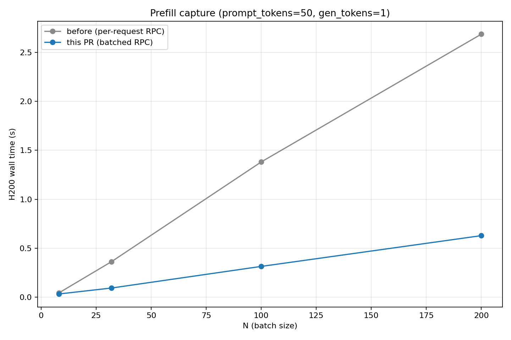
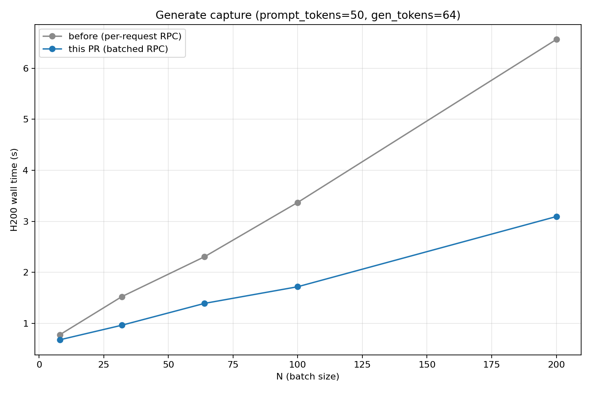

**TL;DR:** On the offline `LLM.generate` path, replace the per-request `collective_rpc("get_captured_states", ...)` loop with one batched call. With ≥32 prompts per `generate()` call this is 1.6-4.4× faster end-to-end on activation-capture workloads.

## Changes

Before this PR, the offline path made one `collective_rpc` per request to fetch captured activations. That's fine for small batches, but if you're sending 200 prompts in one call you end up doing 200 serial subprocess round-trips just to ship data that's already sitting in worker memory. This PR adds a new worker method, `get_captured_states_batch`, that returns the whole batch's payloads in a single RPC, and `_patched_llm_generate` switches over to it.

The async/streaming path is untouched and behaves exactly as before. It can't benefit from batching the same way, because it yields outputs as they finish so there's no natural batch boundary to wait for.

The new batched method skips `zstd`. Offline IPC has no network on the path, so compression would just be a bottleneck on large bf16 tensor payloads. The existing single-request `get_captured_states` still uses zstd, since the HTTP/OpenAI server path does actually cross the network.

DP and TP shouldn't (theoretically) be affected because new method changes the shape of the payload, not how it's communicated. `collective_rpc` still broadcasts and returns rank-ordered results, and the PP-rank concat in the merge works the same way it did before, just done per request instead of once total. I haven't tested this though.

## Performance

Llama-3.1-8B-Instruct, bf16, 3 trials per config in fresh subprocesses, median reported. Each trial does two warmup calls at the measured shape. `enable_prefix_caching=False`.

Prefill (`max_tokens=1`):



Generate (`max_tokens=64`):



## Reproduction

The script below is what produced the plots. Save it as `batched_fetch_speed_bm.py` and run with:

```bash
uv run python batched_fetch_speed_bm.py --main-dir /path/to/upstream/main/checkout
```

It compares `origin/main` against this branch by running each source tree in a fresh subprocess. The main-vs-PR swap works by `PYTHONPATH` override on the spawned subprocess: Python resolves `PYTHONPATH` before site-packages, so the local checkout wins over the installed editable. Each trial does two warmup `generate()` calls at the measured shape before the timed one. Prefix caching is off, `temperature=0.0`.

```python
"""Compare LLM.generate activation-capture wall time: origin/main vs this PR.

Assumes:
  * This branch's vllm-lens is `uv pip install -e .`'d into the current venv.
  * A second checkout of upstream `origin/main` lives at --main-dir.

Main-vs-PR swap is by PYTHONPATH override on the spawned subprocess: Python
resolves PYTHONPATH entries before site-packages, so the local checkout wins
over the installed editable.
"""

from __future__ import annotations

import argparse
import os
import subprocess
import sys
from statistics import median

MODEL = "meta-llama/Llama-3.1-8B-Instruct"
LAYER = 16
CONFIGS = [(8, 50), (32, 50), (100, 50), (200, 50),
           (100, 128), (100, 512), (100, 1024)]


def _worker_code(n: int, pt: int) -> str:
    return f"""
import time, torch
import vllm_lens  # registers plugin
from transformers import AutoTokenizer
from vllm import LLM, SamplingParams

tok = AutoTokenizer.from_pretrained({MODEL!r})
ids = tok.encode("Topic: machine learning. " * 100, add_special_tokens=False)[:{pt}]
prompts = [tok.decode(ids)] * {n}

llm = LLM(model={MODEL!r}, dtype="bfloat16", max_model_len=2048,
          gpu_memory_utilization=0.85, enable_prefix_caching=False)
sp = SamplingParams(temperature=0.0, max_tokens=1,
                    extra_args={{"output_residual_stream": [{LAYER}]}})
for _ in range(2):                       # warmup at the measured shape
    _ = llm.generate(prompts, sp)
torch.cuda.synchronize()
t0 = time.perf_counter()
out = llm.generate(prompts, sp)
torch.cuda.synchronize()
print("WALL_S=" + str(time.perf_counter() - t0))
assert all(o.activations is not None for o in out)
"""


def trial(n: int, pt: int, env: dict[str, str]) -> float:
    r = subprocess.run([sys.executable, "-c", _worker_code(n, pt)],
                       capture_output=True, text=True, env=env)
    for line in r.stdout.splitlines():
        if line.startswith("WALL_S="):
            return float(line.split("=", 1)[1])
    raise RuntimeError(r.stderr[-500:])


def main() -> None:
    p = argparse.ArgumentParser(description=__doc__)
    p.add_argument("--main-dir", required=True,
                   help="Path to a fresh checkout of upstream origin/main.")
    p.add_argument("--trials", type=int, default=3)
    args = p.parse_args()

    main_env = dict(os.environ)
    main_env["PYTHONPATH"] = args.main_dir + os.pathsep + os.environ.get("PYTHONPATH", "")

    print(f"{'config':<20}  {'main':>9}  {'this PR':>9}  speedup")
    for n, pt in CONFIGS:
        ms = [trial(n, pt, main_env) for _ in range(args.trials)]
        ps = [trial(n, pt, os.environ) for _ in range(args.trials)]
        mm, pm = median(ms), median(ps)
        print(f"N={n:<3} pt={pt:<5}      {mm:>8.3f}s  {pm:>8.3f}s   {mm/pm:>5.2f}×")


if __name__ == "__main__":
    main()
```

Hardware/software for the numbers above: 1× H200, NVIDIA driver 580.126.09, torch 2.10.0+cu126, vLLM 0.19.0.