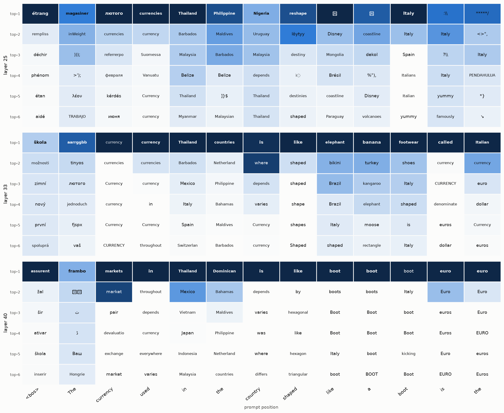
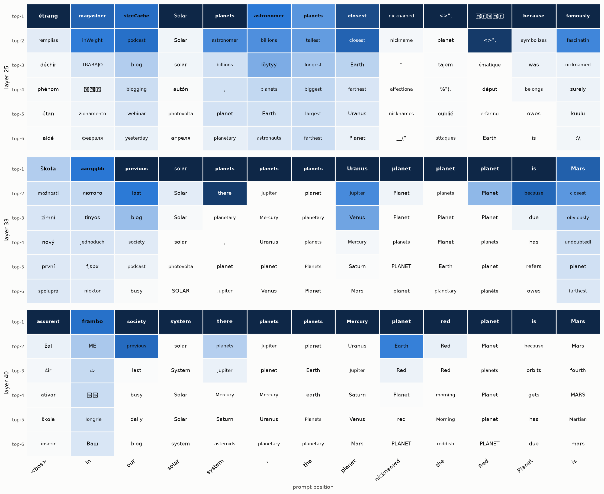

# Scaling the Jacobian lens up: gemma-2-27b via vLLM (TP=4)

Experiment on the `experiments/scale-up` branch. The Jacobian lens *fit* needs
backward passes (the size bottleneck), but *applying* it is forward-only — so we
scale up by serving a large model tensor-parallel and reading out a **pre-fitted
Neuronpedia lens**, no fitting required.

**Setup:** `unsloth/gemma-2-27b` (27B, text-only) served with vLLM at
tensor-parallel-size 4 across 4× L4 (`VLLM_USE_V2_MODEL_RUNNER=0`), plus the
Neuronpedia `gemma-2-27b` lens (45 layers, d_model 4608), applied through the
vllm-lens worker hook. Notes: gemma-2 ties its embeddings (the unembed weight is
`model.embed_tokens.weight`, not `lm_head`), and under TP the hook gathers the
full 256k-vocab weight, so serve with headroom (`--gpu-memory-utilization 0.65`).

## Result: indirect, multi-hop concepts the small models couldn't reach

Prompt: *"The currency used in the country shaped like a boot is the"* — top-k
Jacobian-lens tokens per position, at three layers:



The 27B resolves the whole chain **internally, before emitting anything**:

| position | layer 25 | layer 33 | layer 40 |
|---|---|---|---|
| ` boot` | **Italy** | footwear / Italy | boot |
| ` the` (final) | Italy | **Italian** | **euro** |
| ` is` | — | called | **euro** |

i.e. *"boot-shaped country → **Italy** → its currency, the **euro**"* — a
two-hop inference (epithet → country → currency) surfaced in the residual stream.
On Qwen3-0.6B / 1.7B the same prompt only produced literal "boot/footwear"; the
capability emerges with scale, matching the paper's indirect examples.

Reproduce:

```bash
VLLM_USE_V2_MODEL_RUNNER=0 vllm serve unsloth/gemma-2-27b --tensor-parallel-size 4 --gpu-memory-utilization 0.65
python examples/jacobian_lens.py run \
    --lens <neuronpedia gemma-2-27b lens.pt> \
    --prompt "The currency used in the country shaped like a boot is the" \
    --grid-out boot.png
```

## A second example: epithet → referent

Prompt: *"In our solar system, the planet nicknamed the Red Planet is"* — at the
final position the lens reads out **Mars** from the mid layers on (L33, L40),
with candidate planets (Uranus, Mercury) surfacing at ` planet` — the model
resolves the epithet "Red Planet" → **Mars** internally.


